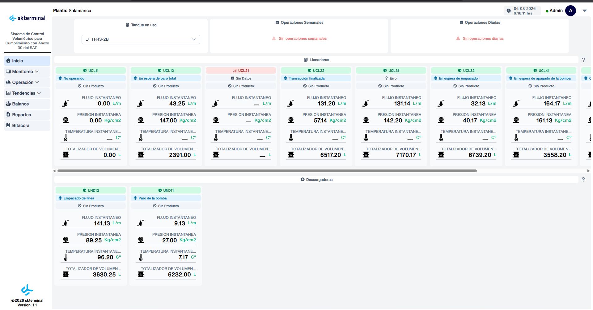
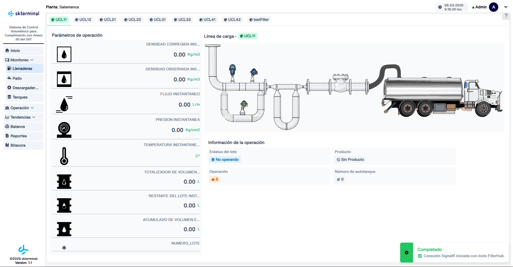
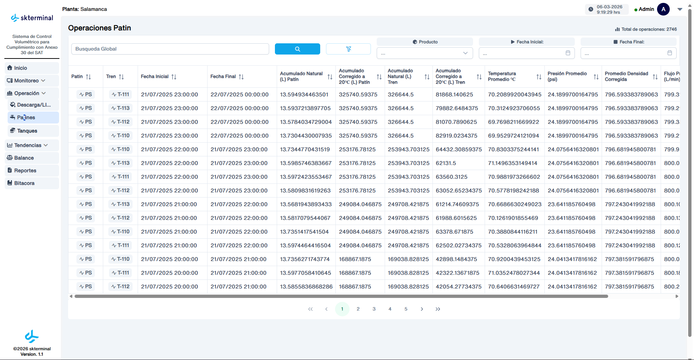
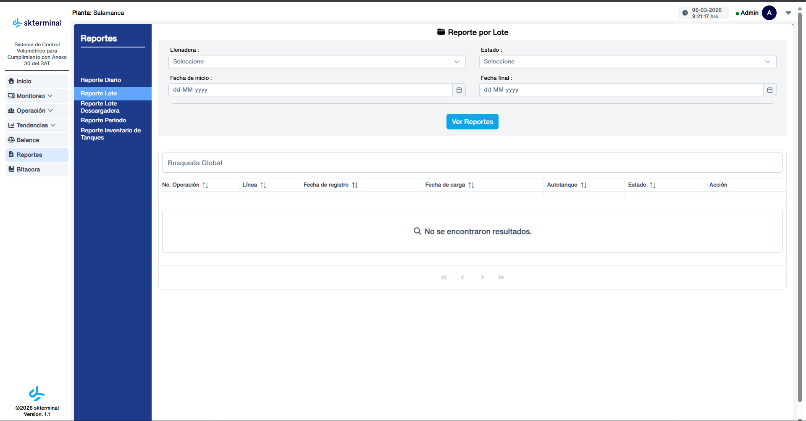
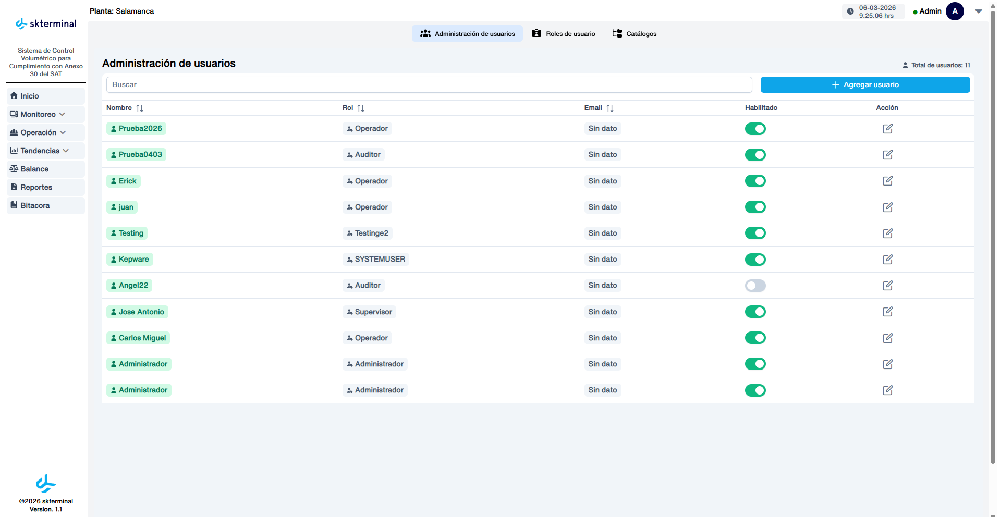
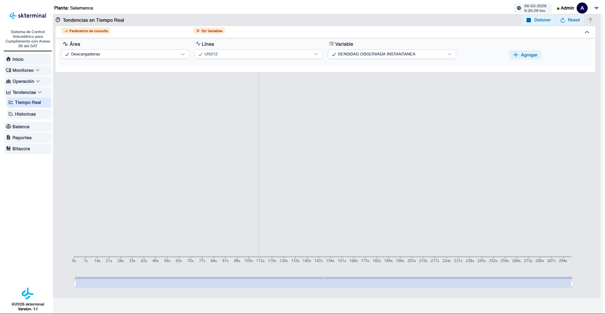

# Plataforma de Monitoreo Industrial

Sistema para monitoreo y gestión de infraestructura industrial como bombas, ductos y operaciones en tiempo real.

## Tecnologías utilizadas

- Vue 3
- .NET 8
- RabbitMQ
- SignalR
- PostgreSQL

## Dashboard principal

Pantalla principal del sistema donde se monitorean bombas, ductos y el estado general de la infraestructura.

## Módulo de monitoreo

Vista enfocada en el monitoreo en tiempo real de los diferentes componentes del sistema.

## Tabla de operaciones

Tabla que muestra las operaciones registradas dentro del sistema, permitiendo visualizar y gestionar la información.

## Reportes generados

Módulo para generación y visualización de reportes del sistema.

## Gestión de roles y permisos

Panel administrativo para la configuración de usuarios, roles y permisos dentro del sistema.

## Tendencias en tiempo real

Vista que permite visualizar tendencias y comportamiento de datos en tiempo real.

## Contribución personal

Mi participación principal en el proyecto incluyó:

- Desarrollo de **vistas y componentes en el frontend con Vue 3**
- Implementación de **tablas dinámicas y visualización de datos**
- Integración de **RabbitMQ en endpoints del backend**
- Desarrollo de **endpoints en .NET 8**
- Creación y gestión de **migraciones en PostgreSQL**
